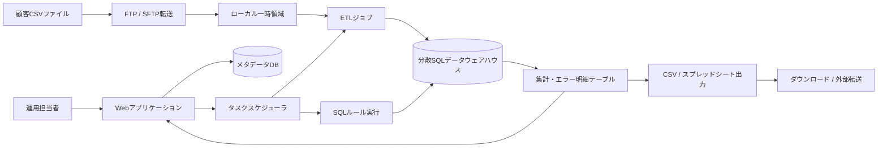
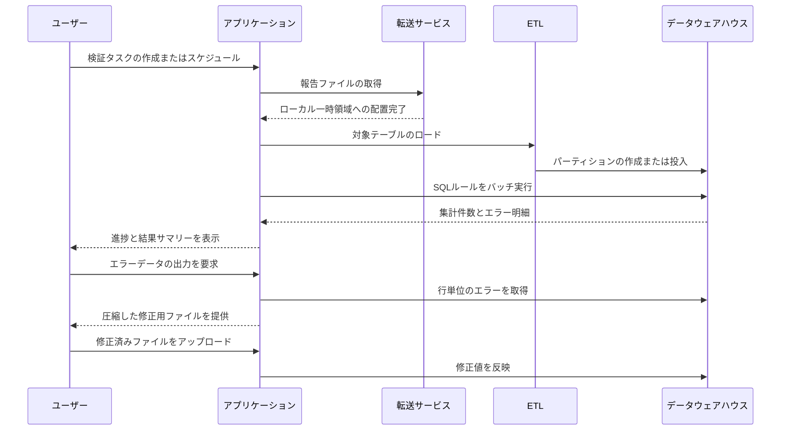
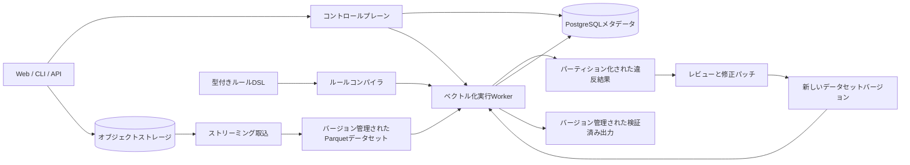

# エンタープライズデータ品質プラットフォーム：エンジニアリング回顧録

[English](README.md) | [简体中文](README.zh-CN.md) | 日本語

規制対象となる金融報告業務で利用されたデータ品質プラットフォームについて、匿名化したアーキテクチャ事例としてまとめたものです。このリポジトリには製品のソースコードを含めていません。開発時の背景、システム設計、私が担当した業務、運用で直面した課題、そして現在であれば採用するアーキテクチャを記録しています。

> 本文は、職務経験から得た一般化可能な知見をもとに独自に執筆したものです。以前の勤務先のソースコード、顧客データ、独自のルール定義、データベーススキーマ、認証情報、内部アドレス、画面キャプチャ、機密性のある性能値は一切含まれていません。

## 概要

このプラットフォームは、規制当局へ提出する前の大規模な報告データを検証するためのものでした。顧客からは、相互に関連する複数テーブルの区切り文字形式ファイルが提供されます。システムはそれらを転送して分析用データベースへロードし、多数のSQL検証ルールを実行し、集計結果と行単位のエラーを表示します。さらに、修正用ファイルの出力と報告ファイルの生成も行います。

実際の運用要件に対応するため、組織・ユーザー管理、定期検証、ファイル転送、ルール管理、進捗表示、結果確認、エラー出力、修正済みファイルの再取込、レポート生成までをカバーしていました。

一方で、すべての検証処理において、顧客ファイルを最初に専用のデータベース基盤へ格納する必要がありました。この方式によりSQLの高い表現力を活用できた反面、取込、保存、検証、修正、デプロイが強く結合しました。その結果、長時間ジョブの監視と復旧が難しくなり、顧客別の構成差分が増え、中間データがストレージを圧迫するようになりました。

## 運用上の前提

このプラットフォームには、規制対象のエンタープライズシステムで一般的な制約がありました。

- 外部ネットワークへの接続が制限されたオンプレミス環境
- 多数のテーブルで構成される大容量ファイル
- 1,000件を超え、継続的に更新される検証ルール
- 報告要件の変更後に求められる短期間でのリリース
- 顧客ごとに異なる認証、転送、命名規則、デプロイ方式
- 追跡可能な検証結果とダウンロード可能な証跡
- 部分実行や不整合に対する厳しい許容条件

異なる分析基盤に対応するため、2種類のデプロイ構成が存在していました。どちらの構成でも、アプリケーションのメタデータは別のリレーショナルデータベースで管理していました。

## 旧アーキテクチャ

Webアプリケーションが、外部ETLプロセス、SQL実行、ローカルファイル、転送サービス、複数のデータベースを統括していました。検証ルールは主にSQLとして保存され、集計件数やエラー明細を取得するために複数形式のSQLへ変換されていました。

## 検証処理の流れ

## 私が担当した業務

アプリケーションの挙動とデータ処理から、デプロイ、実運用サポートまで、プラットフォームのライフサイクル全体に携わりました。主な担当内容は以下のとおりです。

### 安定したタスク実行

- 日次・月次の定期検証機能の実装と保守
- タスク状態、開始時刻、ログ、進捗表示の改善
- 失敗、停止、状態不整合が発生した検証ジョブの原因調査
- 外部ETLプロセスのキャンセルと後処理
- 実行中タスクに関連するルール分類が安全でない状態で変更されることの防止

### 大容量ファイルの転送と結果配信

- 顧客環境ごとのFTP・SFTP同期の改善
- ディレクトリ未作成、標準外ポート、転送停止、過剰なコマンド数への対応
- ブラウザから利用できるエラー結果ダウンロードの追加
- 出力件数と進捗表示の追加
- 重複、上書き、空ファイル、誤った命名、文字コード問題の修正
- 入力、エラー、報告ファイルに対する保存期間とクリーンアップ方針の実装

### ルールとレポート

- ルールのインポート、エクスポート、分類、カスタムルール機能の保守
- 不完全なルールメタデータやSQL変換に起因する失敗の修正
- タスク履歴、結果サマリー、ローカライズされた説明、組織別レポートの改善
- 定期レポート生成と下流システムの配信規約への対応

### 認証とセキュリティ強化

- シングルサインオン連携と動的な鍵取得への対応
- ユーザー同期、認可チェック、組織単位のアクセス制御の改善
- 設定値の暗号化とHTTPセキュリティヘッダーの追加
- リクエスト元、リファラ、SQLインジェクションに関するリスクへの対応

### デプロイと実運用サポート

- デプロイおよびアップグレード手順書の保守
- 顧客固有のインフラ制約への適応
- データベース接続、プロセス、SSH、ファイル権限、環境差異に起因する問題の調査
- 繰り返し発生する運用上の問題を製品改善へ反映

## 有効だった設計

### SQLによる高いルール表現力

SQLを利用することで、行単位の検査、テーブル間の整合性、集計値の照合、期間条件、顧客固有の例外などを表現できました。件数が多く、頻繁に更新されるルール群を実行するための現実的な手段でした。

### 業務フロー全体をカバーした製品

単なる検証ライブラリではなく、スケジュール、転送、タスク管理、結果確認、修正ファイル、レポート、顧客環境との連携までを扱っていました。

### 実運用から得られた知見

実際の導入環境を通して、転送失敗、曖昧な進捗、不十分なクリーンアップ、権限問題、顧客環境ごとの差異が明らかになりました。これらは検証用プロジェクトだけでは得にくい実践的な知見でした。

## 繰り返し発生した課題

### デプロイ構成の分岐による運用コスト

分析基盤ごとに異なる構成をサポートしたため、インストール、設定、試験、アップグレードの工数が増加しました。さらに、ETLランタイム、メタデータDB、ファイル転送サービス、ローカル一時領域、顧客別スクリプトにも依存していました。

### 多段階でのデータ複製

1回の処理で、受領ファイル、転送後のコピー、一時ファイル、分析DBのテーブル、結果テーブル、出力CSV、圧縮アーカイブという複数のデータ表現が生成されました。途中で失敗すると大容量の中間データが残り、顧客環境のストレージを圧迫する可能性がありました。

### 長時間処理に対する弱い復旧境界

取込と検証には数時間かかる場合がありました。タスク状態は、データベースのレコード、プロセス内キュー、スレッド、外部プロセスID、一時ファイルに分散していました。アプリケーション再起動時に実行状態の一部が失われ、復旧には状態の整理と高コストな処理の再実行が必要になることがありました。

### 実際の作業量と一致しない進捗

進捗は処理段階、ルール数、日付パーティション数から推定していました。しかし各単位の処理コストは均一ではありません。複雑な結合を含む1件のルールが多数の単純なルールより長くかかる場合があり、同じ日付単位でもデータ件数は大きく異なりました。

### 生SQLによるルール提供コスト

規制要件が更新されるたびに、専門知識を持つ担当者が多くのSQLを作成する必要がありました。検証件数、エラー明細、パーティション処理、テーブル名置換のために複数のSQL形式が必要であり、小さな書式やメタデータの誤りでも長時間処理の途中まで発見されないことがありました。

### 運用データを直接変更する修正処理

エラー行を出力し、編集後のファイルを再取込できましたが、修正値は分析用テーブルへ直接反映されました。この方式では、変更前の履歴、フィールド単位のレビュー、ロールバック、再現可能な再検証を実現することが困難でした。

### 顧客固有処理のコアフローへの混入

認証方式、通知手段、ファイル名、転送方式、スケジュール、レポート形式は顧客ごとに異なりました。明確な拡張境界がなければ、これらの差異は結合度と回帰リスクを増加させます。

## 設計から得た教訓

1. データセット、ルール、修正、結果を不変かつバージョン管理された成果物として扱う。
2. ワークフロー状態を永続化し、プロセス内のMapやスレッド状態を復旧手段にしない。
3. 経過時間や不均一なルール数ではなく、確定済みのバイト数またはパーティション数から進捗を算出する。
4. コントロールプレーンとデータプレーンを分離する。メタデータはトランザクションDBへ保存し、大容量レコードは用途に適したストレージで管理する。
5. 任意SQLを主要なルール作成手段にせず、制約と型を持つルール言語を実行バックエンドへコンパイルする。
6. 認証、転送、通知、出力に関する顧客差異を明示的なアダプターとして実装する。
7. クリーンアップ、保存期間、キャンセル、再試行を補助スクリプトではなく正式なワークフロー状態として設計する。
8. 入力、スキーマ、ルール、実行バージョン、修正履歴、出力を各実行の証跡として保存する。

## 現在であれば採用するアーキテクチャ

再設計後のプラットフォームでは、大容量データをオブジェクトストレージと分割Parquetで管理し、コントロールプレーンの状態をPostgreSQLへ保存します。標準の実行経路にはベクトル化SQLエンジンを使用し、さらに大規模な分散処理については、同一の型付きルール表現から別の実行バックエンドを利用できるようにします。

修正内容はレビュー済みパッチとして保存し、新しいデータセットバージョンを作成します。再検証ではデータセットとルールの正確なバージョンを参照するため、元の提出データを上書きせずに結果を再現できます。

## 本文の範囲

本文では、一般化可能なアーキテクチャパターンとエンジニアリング上の知見のみを扱っています。名称、図、用語は、この事例のために独自に再構成しました。数値については、公開された合成データで再現できるものを除き、意図的に定性的な表現に留めています。

関連するオープンソースプロジェクト
[`data-quality-rule-engine`](https://github.com/zhuoqun-xu/data-quality-rule-engine)
は、合成データのみを使用した独立実装です。以前の製品や独自ルールを再現したものではありません。
