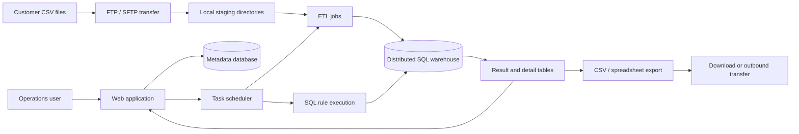
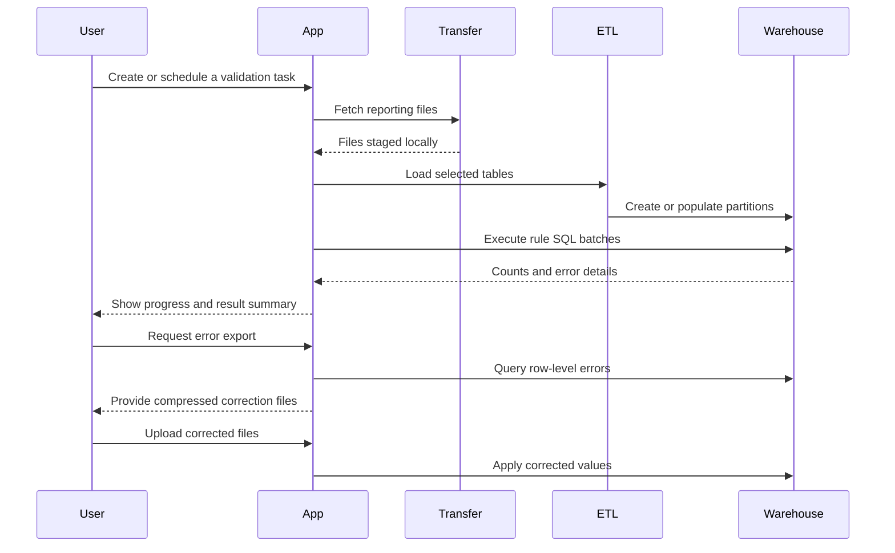
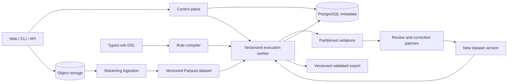

# Enterprise Data Quality Platform: An Engineering Retrospective

An anonymized architecture case study of a data-quality platform used in a
regulated financial reporting workflow. This repository contains no product
source code. It documents the engineering context, the system design, the work
I performed, the operational problems I encountered, and the architecture I
would choose today.

> This retrospective is independently written from generalized professional
> experience. It contains no former employer source code, customer data,
> proprietary rule definitions, database schemas, credentials, internal
> addresses, screenshots, or confidential performance figures.

## Executive summary

The platform validated large batches of regulatory reporting data before
submission. Customers delivered delimited files containing many related
tables. The system transferred and loaded those files into an analytical
database, executed a large catalog of SQL validation rules, presented summary
and row-level errors, exported correction files, and produced reporting files.

The system solved a real operational problem and accumulated substantial
workflow coverage: organization and user management, scheduled validation,
file transfer, rule administration, progress reporting, result exploration,
error export, corrected-file import, and report generation.

Its central architectural constraint was that every validation run first
materialized customer files into a dedicated database platform. That decision
made expressive SQL validation possible, but it also coupled ingestion,
storage, validation, correction, and deployment. Long-running jobs became
difficult to observe and recover, customer-specific variants multiplied, and
large intermediate datasets placed pressure on storage.

## Operating context

The platform had to work under constraints common to regulated enterprise
software:

- on-premises deployment with restricted network access;
- large, multi-table file deliveries;
- evolving rule catalogs containing more than one thousand checks;
- urgent release schedules after reporting requirements changed;
- customer-specific identity, transfer, naming, and deployment conventions;
- traceable results and downloadable evidence;
- limited tolerance for partial or inconsistent processing.

Two deployment variants evolved around different analytical data platforms.
Both retained a separate relational database for application metadata.

## Legacy architecture

The web application coordinated external ETL processes, SQL execution, local
files, transfer services, and multiple databases. Validation rules were stored
primarily as SQL or generated into several SQL forms for summary counts and
error-detail extraction.

## Validation lifecycle

## My work

I worked across the full lifecycle of the platform, from application behavior
and data workflows to deployment and production support. My responsibilities
included:

### Reliable task execution

- implemented and maintained scheduled daily and monthly validation;
- improved task state, start-time, log, and progress visibility;
- diagnosed validation jobs that failed, stalled, or left inconsistent state;
- handled cancellation and cleanup around external ETL processes;
- prevented unsafe rule-category changes while related tasks were running.

### Large-file movement and result delivery

- improved FTP and SFTP synchronization across customer environments;
- handled missing directories, non-default ports, stalled transfers, and
  excessive command counts;
- added browser-accessible error-result downloads;
- added export counts and progress reporting;
- fixed duplicate, overwritten, empty, incorrectly named, and incorrectly
  encoded result files;
- implemented retention and cleanup policies for input, error, and reporting
  files.

### Rules and reporting

- maintained rule import, export, category, and custom-rule workflows;
- fixed failures caused by incomplete rule metadata and SQL transformation;
- improved task history, result summaries, localized explanations, and
  institution-level reports;
- supported scheduled report generation and downstream delivery conventions.

### Identity and security hardening

- worked on single sign-on integration and dynamic key acquisition;
- improved user synchronization, authorization checks, and organization-level
  access control;
- added configuration encryption and HTTP security headers;
- addressed request-origin, referrer, and SQL-injection risks.

### Deployment and production support

- maintained deployment and upgrade documentation;
- adapted the product to customer-specific infrastructure constraints;
- diagnosed database connection, process, SSH, file-system permission, and
  environment-specific failures;
- converted recurring support incidents into product fixes.

## What worked well

### SQL provided broad rule expressiveness

SQL could represent row checks, cross-table relationships, aggregate
reconciliation, temporal conditions, and customer-specific exceptions. It was
a practical execution language for a large and rapidly changing rule catalog.

### The product covered the operational workflow

The platform went beyond a validation library. It addressed scheduling,
transfer, task management, result exploration, correction-file handling,
reporting, and customer integration.

### Production feedback shaped the system

Real deployments exposed transfer failures, ambiguous progress, incomplete
cleanup, permission problems, and differences between customer environments.
These incidents produced engineering knowledge that is difficult to gain from
a laboratory-only project.

## Recurring problems

### Deployment variants multiplied operational cost

Supporting separate analytical-platform variants increased installation,
configuration, testing, and upgrade effort. The application also depended on
an ETL runtime, a metadata database, file-transfer services, local staging
storage, and customer-specific scripts.

### Data was copied through too many stages

A typical run created several representations of the same delivery: source
files, transfer copies, staging files, analytical database tables, result
tables, exported CSV files, and compressed archives. Failures could leave
large intermediate artifacts behind and exhaust customer storage.

### Long-running steps had weak recovery boundaries

Loading and validation could take hours. Task state combined database records,
in-process queues, threads, external process identifiers, and temporary files.
A restart could lose part of the execution context, and recovery often meant
cleaning state and repeating expensive work.

### Progress represented workflow structure rather than completed work

Progress was inferred from stages, rule counts, or date partitions. These units
had uneven costs: one join-heavy rule could take longer than many simple rules,
and two date partitions could contain radically different row counts.

### Raw SQL made rule delivery expensive

Every regulatory revision required substantial specialist effort. SQL variants
were needed for validation counts, detailed error queries, partition handling,
and table-name substitution. Small formatting or metadata errors could surface
only after a long-running task reached that rule.

### Correction changed operational data directly

The correction workflow allowed exported rows to be edited and uploaded, but
the updated values were applied to analytical tables. This made immutable
history, field-level review, rollback, and reproducible revalidation difficult.

### Customer-specific behavior entered the core workflow

Identity systems, notification methods, file names, transfer modes, schedules,
and report formats varied between deployments. Without stable extension
boundaries, these differences increased coupling and regression risk.

## Design lessons

1. Treat datasets, rules, corrections, and results as immutable, versioned
   artifacts.
2. Store workflow state durably; process-local maps and thread state are not a
   recovery mechanism.
3. Define progress from committed bytes or partitions, not elapsed time or the
   number of heterogeneous rules.
4. Separate the control plane from the data plane. Metadata belongs in a
   transactional database; bulk records do not necessarily belong there.
5. Compile a constrained, typed rule language into an execution backend rather
   than exposing arbitrary SQL as the primary authoring interface.
6. Make customer differences explicit adapters for identity, transfer,
   notification, and export.
7. Design cleanup, retention, cancellation, and retries as primary workflow
   states rather than support scripts.
8. Preserve evidence for every run: input identity, schema, rule version,
   execution version, correction history, and output identity.

## Architecture I would choose today

The redesigned platform would use object storage and partitioned Parquet for
bulk data, PostgreSQL for control-plane state, and a vectorized SQL engine for
the default execution path. Large distributed workloads could use another
backend through the same typed rule representation.

Corrections would be stored as reviewed patches that create a new dataset
version. Revalidation would reference exact dataset and rule versions, making
results reproducible without overwriting the original submission.

## Scope of this retrospective

This document describes general architecture patterns and engineering lessons.
Names, diagrams, and terminology were independently recreated for this case
study. Any quantities are intentionally qualitative unless they can be
reproduced with public synthetic data.

The companion open-source project,
[`data-quality-rule-engine`](https://github.com/zhuoqun-xu/data-quality-rule-engine), is an independent
implementation built with synthetic data. It does not reproduce the former
product or its proprietary rules.
