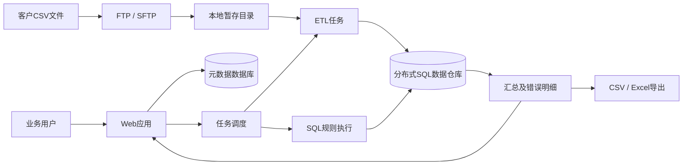
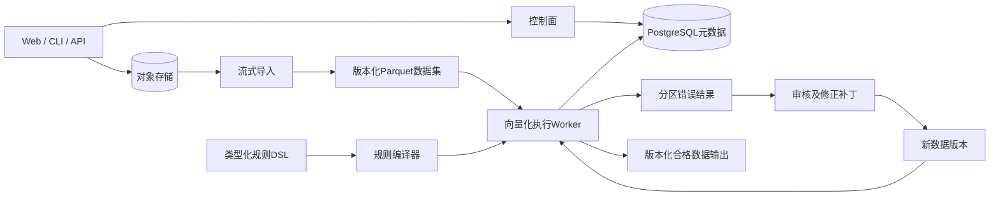

# 企业级数据质量平台：工程复盘

这是一份经过匿名化处理的架构案例，介绍我参与设计、开发、交付和维护的一套受监管金融数据质量平台。本仓库不包含原产品代码，只讨论业务背景、架构、我承担的工作、生产环境中反复出现的问题，以及我现在会采用的设计。

> 本文根据通用职业经验独立撰写，不包含前雇主源代码、客户数据、专有规则、数据库结构、凭据、内部地址、截图或保密性能数据。

## 系统解决的问题

客户需要在监管数据上报前，对多张相互关联的表进行大批量校验。系统负责接收CSV文件、加载数据、运行大规模SQL规则、展示错误、导出整改文件，并生成最终上报文件。

平台逐步覆盖了机构与用户管理、定时校验、FTP/SFTP同步、规则管理、任务进度、结果查询、错误数据导出、修正文件导入和报表生成。

## 原架构

## 我负责的工作

- 每日和每月定时校验、任务状态、日志、启动时间和进度；
- 外部ETL进程取消、失败处理和环境问题排查；
- FTP/SFTP同步、目录创建、端口配置、卡死和大批量命令问题；
- 浏览器错误文件下载、导出数量和进度；
- 重复、覆盖、空文件、命名、编码和权限问题；
- 规则导入导出、自定义规则、分类和SQL转换问题；
- 任务历史、结果汇总、本地化错误说明和机构报表；
- 单点登录、用户同步、机构权限和授权检查；
- 配置加密、安全响应头、来源校验和SQL注入风险处理；
- 部署与升级文档、数据清理策略和客户环境适配；
- 将生产支持中重复发生的问题转化为产品修复。

## 主要问题

1. Greenplum和Hive形成两套部署及维护路径。
2. CSV、暂存目录、数据仓库、结果表、导出文件和压缩包形成多份数据副本。
3. 导入与校验可能运行数小时，失败后的恢复边界不清楚。
4. 进度主要根据阶段、规则数量或日期分区估算，与真实工作量不完全一致。
5. 上千条SQL规则需要大量人工编写、转换和调试。
6. 修正文件可以更新数据，但缺少不可变版本、逐字段审批和可靠回滚。
7. 登录、传输、通知、文件名和报表格式等客户差异逐渐进入主流程。
8. 清理、保留、取消和重试更多依赖外围逻辑，而不是统一的任务状态模型。

## 得到的设计经验

- 数据集、规则、修正和结果都应该不可变并带版本。
- 任务状态必须持久化，内存队列和线程状态不能承担故障恢复。
- 进度应该来自已提交的字节或分区，而不是规则数量或运行时间。
- 控制面和数据面应该分离，PostgreSQL保存元数据，大批量数据使用对象存储和Parquet。
- 使用有类型、受限制的规则DSL，再编译到执行引擎。
- 身份、传输、通知和导出应该通过明确适配器处理客户差异。
- 输入、Schema、规则、执行程序、修正和输出都应该具有可追溯身份。

## 现在会采用的架构

配套开源项目 `data-quality-rule-engine` 使用完全虚构的合成数据独立实现，不复刻原公司产品，也不包含专有规则。
